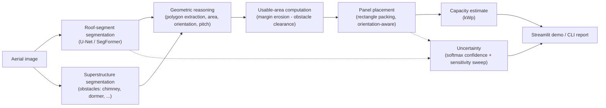
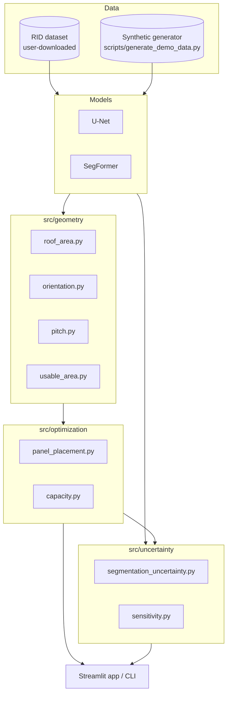

# AI-Based Roof Geometry & Solar Potential Estimation

End-to-end applied computer-vision system: aerial imagery -> deep-learning roof segmentation ->
geometric reasoning -> obstacle-aware solar-panel placement -> capacity & uncertainty estimate.

**Stack:** Python, PyTorch, HuggingFace Transformers (SegFormer), OpenCV, Shapely, Streamlit.
**Techniques:** semantic segmentation (CNN + transformer), computational geometry (polygon
buffering/difference, rectangle packing), sensitivity-based uncertainty quantification,
reproducible experiment design.



> **Honesty-first design.** Every physical-unit output is labeled as a *measurement*, a *model
> prediction*, or a *documented estimate/assumption*. Panel counts come from real rectangle
> packing, never `area / panel_area`. Pitch is a regional-prior heuristic, never claimed as a 3D
> measurement from a single photo. Uncertainty ranges come from softmax statistics and an
> explicit sensitivity sweep, never from `random.uniform(...)`.

## Overview

This project analyzes top-down aerial/orthophoto imagery of buildings to estimate rooftop
photovoltaic (PV) potential: how much roof area exists, how much of it is actually usable once
obstacles and safety margins are accounted for, how many solar panels physically fit, and what
installed capacity that represents — together with an honest uncertainty estimate and visual
explanations at every stage.

## Motivation

Manual rooftop-solar assessment does not scale. Automating it requires more than a segmentation
model: usable area depends on obstacle geometry and installation safety margins, panel count
depends on real 2D packing (not an area ratio), and any number handed to a homeowner or planner
needs an honest uncertainty range. This project demonstrates that full pipeline, end to end, on 
top of a real published dataset's class taxonomy.

## Problem Statement

Given a nadir aerial image of a building (and optionally its ground-sampling distance), produce:
roof area, usable area, dominant orientation, an approximate pitch, a geometrically valid panel
layout, an installed-capacity estimate, and an uncertainty range — with clear separation between
what was measured, predicted, and assumed.

## Research Question

> **Can deep-learning-based roof segmentation combined with geometric reasoning and obstacle
> detection improve the estimation of usable photovoltaic roof area and solar-panel capacity?**

Answered via a controlled 3-way ablation (see [Methodology](#methodology) and
[Results](#results)):

| Experiment | Segmentation | + Geometric reasoning | + Obstacle detection |
|---|:---:|:---:|:---:|
| **A** — segmentation only | Yes | No (naive `area/panel_area`) | No |
| **B** — + geometry | Yes | Yes (real placement, margin erosion) | No |
| **C** — full pipeline | Yes | Yes | Yes |

## System Architecture



## Dataset

Primary dataset: **[RID — Roof Information Dataset](https://github.com/TUMFTM/RID)** (TUMFTM),
built specifically for CV-based PV-potential assessment (Krapf et al., 2022,
[doi:10.3390/rs14102299](https://doi.org/10.3390/rs14102299)). Verified class taxonomy (from
RID's own `definitions.py`, not assumed):

- **Roof superstructures**: `pvmodule, dormer, window, ladder, chimney, shadow, tree, unknown`
- **Roof segments (orientation)**: `N, NE, E, SE, S, SW, W, NW, flat` (9-class default)

RID's raster data is **not redistributed here** (LGPL code license; Google-imagery fair-use
terms) — see [`data/README.md`](data/README.md) for exact download + placement instructions.
A **synthetic data generator** (`scripts/generate_demo_data.py`) makes the entire non-training
pipeline, the test suite, and the Streamlit demo runnable with zero external downloads.

## Data Pipeline

- **Discovery, not hard-coding**: `src/data/dataset.py::discover_dataset_root()` finds
  image/mask directories under any dataset root matching RID's or the synthetic generator's
  naming, and works from either.
- **Reproducible splits**: `src/data/splits.py` — seeded shuffle, persisted to `data/splits/`.
- **Augmentation**: Albumentations pipeline (`src/data/transforms.py`) — flips, rotation,
  brightness/contrast/hue jitter, affine, Gaussian noise; masks resized nearest-neighbor to
  preserve class ids.
- **Statistics & exploration**: `src/data/stats.py`, `notebooks/01_data_exploration.ipynb`.

## Models

| Model | File | Notes |
|---|---|---|
| U-Net | `src/models/unet.py` | From-scratch, configurable depth/width. Baseline. |
| SegFormer | `src/models/segformer.py` | HuggingFace `SegformerForSemanticSegmentation`, `nvidia/segformer-b0-finetuned-ade-512-512` pretrained backbone, fine-tuned end-to-end. |

Both share one interface (`src/models/factory.py`) — `forward(x) -> (B, num_classes, H, W)` —
and one training loop (`src/training/trainer.py`): CPU/GPU auto-detection, mixed precision when
CUDA is available, checkpointing on best validation mIoU, early stopping, `ReduceLROnPlateau`.
Loss: combined Dice + Cross-Entropy (`src/models/losses.py`), chosen for robustness to the severe
class imbalance between background/roof pixels and small obstacle classes.

## Methodology

1. **Segmentation** — two independent single-task segmentation models for roof segments and
   superstructures, using a shared training framework and model interface.
2. **Geometric reasoning** — predicted masks are converted to Shapely polygons
   (`src/geometry/polygons.py`) via OpenCV contour extraction (holes preserved for e.g. a chimney
   fully inside a roof polygon), then:
   - **Roof area** = `pixel_area * GSD^2`, GSD required-or-flagged-assumed, never invented.
   - **Orientation** = dominant roof-segment class (RID encodes azimuth as the segment label).
   - **Pitch** = archetype heuristic (see [Roof Geometry](#roof-geometry)).
   - **Usable area** = roof polygon eroded by a safety margin, minus obstacle polygons (each
     dilated by a clearance) — real polygon boolean ops, not a flat percentage.
3. **Obstacle-aware panel placement** — real rectangle packing inside the usable polygon.
4. **Capacity** = `num_panels * panel_power_w / 1000`.
5. **Uncertainty** = softmax-confidence + sensitivity-sweep based range.

## Roof Geometry

Orientation is read directly from the predicted roof-segment class — a legitimate byproduct of
segmentation, since RID itself derives each segment's label from its true azimuth. **Pitch is
different**: a single nadir image contains no direct geometric cue for out-of-plane tilt without
a second view or an elevation source. `src/geometry/pitch.py` therefore classifies a coarse roof
archetype (flat / single-pitch / gable-or-hip / complex) from the *visible* cue — how many
distinct segment orientations are present — and reports a documented **regional architectural
prior** range (e.g., 25-45° for gable/hip, consistent with the ~35° values seen in RID's own
sample vector labels), explicitly labeled `is_measurement=False`. This is stated plainly
everywhere the number is surfaced (CLI, Streamlit, this README) rather than presented with false
precision.

## Obstacle Detection

A second semantic-segmentation model, same architecture family, trained on RID's superstructure
taxonomy. Obstacle polygons are extracted per class (`src/geometry/polygons.py`) and split into
**hard obstacles** (dormer, window, ladder, chimney, tree, unknown — excluded from usable area
with a clearance buffer), **soft obstacles** (shadow — reported but not excluded by default,
config-overridable), and **existing PV modules** (reported separately, not treated as an
obstacle to avoid). See `src/data/label_maps.py`.

## Solar Panel Optimization

`src/optimization/panel_placement.py` builds a rotated grid of candidate panel rectangles aligned
to the roof's dominant orientation (rows parallel to the inferred ridge), keeps only candidates
fully contained in the usable polygon, and greedily accepts non-overlapping candidates —
deterministic and reproducible. `optimize_placement_multi_orientation` extends this with a small
discrete search over orientation offsets and portrait/landscape panel aspect, keeping the best
count. The naive `usable_area / panel_area` baseline is implemented too, *only* to quantify how
much it overstates real placement (see Experiment A vs. B/C below and
`tests/test_panel_placement.py::test_naive_ratio_overstates_relative_to_real_placement`).

## Uncertainty

Two real signals, combined in `src/uncertainty/pipeline_uncertainty.py`:

1. **Segmentation confidence** — per-pixel softmax margin + entropy from actual model logits.
2. **Sensitivity analysis** — a 27-point full-factorial sweep of ±30% safety margin/clearance and
   ±5% GSD, re-running the real geometry+placement pipeline at each setting.

Reported as an explicit **range + Low/Medium/High level + a plain-text explanation of how it was
computed** — never presented as a formally calibrated confidence interval (no calibration dataset
was available to justify that stronger claim).

## Evaluation

`src/evaluation/metrics.py` accumulates a running confusion matrix (not per-batch averages) to
compute IoU, Dice/F1, precision, recall, and pixel accuracy, both overall and per-class.
`scripts/evaluate.py` runs this on a held-out test split and saves qualitative
input/ground-truth/prediction/error-map figures to `results/predictions/`.

## Error Analysis

`results/predictions/` contains representative failure-case figures. See
`docs/research_report.md` §8 for the qualitative discussion (obstacle classes with small,
high-variance footprints and adjacent-compass-bin orientation confusion are the expected harder
cases; RID's own inclusion of a `shadow` class reflects a known real-world difficulty driver this
project's synthetic generator does not attempt to fully reproduce).

## Results

> Numbers below are **actually produced by running this repository's own training and evaluation
> scripts** on the synthetic dataset in this development environment (CPU-only U-Net, 120
> synthetic samples, 84/18/18 train/val/test split; RID's real raster data requires a manual,
> licensed download not available here — see [Limitations](#limitations)). They are not
> fabricated, and are exactly reproducible by re-running the commands below (deterministic
> seeding). See `results/metrics/*.json` for the full machine-readable output and
> `results/predictions/` for qualitative figures.

**Segmentation (test split, 18 samples), U-Net baseline:**

| Task | mIoU | Dice | Precision | Recall | Pixel Acc. |
|---|---:|---:|---:|---:|---:|
| Roof-segment orientation (10-class, early-stopped epoch 3) | 0.128 | 0.150 | 0.222 | 0.201 | 0.819 |
| Superstructure/obstacle detection (9-class, early-stopped epoch 28) | 0.730 | 0.740 | 0.982 | 0.743 | 0.997 |

The orientation task's low mIoU is an honest CPU-only-budget result (the best validation mIoU
was reached at epoch 3 during an 11-epoch training run on 84 training images with a 10-way
pixel classification problem) — see
[Limitations](#limitations) — while the obstacle-detection task, an easier problem (mostly
background plus a few visually distinct shapes), trained well.

**Experiment A/B/C comparison — mean absolute % error vs. an oracle reference (ground-truth
masks run through the same geometry/placement code):**

| Experiment | Roof area | Usable area | Panel count | Capacity |
|---|---:|---:|---:|---:|
| **A** — segmentation only (naive `area/panel_area`) | 14.5% | 40.7% | 234.4% | 234.4% |
| **B** — + geometric reasoning (real placement, margin, no obstacles) | 14.5% | 22.0% | 48.4% | 48.4% |
| **C** — + obstacle detection (full pipeline) | 14.5% | **19.8%** | **38.1%** | **38.1%** |

This directly answers the research question on the synthetic development set: adding geometric
reasoning cuts panel-count error by ~4.8x (234%→48%) over the naive baseline, and adding obstacle
detection on top reduces it further (48%→38%) and usable-area error (22%→20%). Roof-area error is
identical across experiments because all three read roof area from the same segmentation output
— only usable-area/panel-count/capacity depend on the geometric-reasoning and obstacle-detection
stages. See `docs/research_report.md` §7-§8 for the full discussion and
`notebooks/04_results_analysis.ipynb` for the executed analysis.

Re-run with `python scripts/evaluate.py ...` and `python scripts/run_experiment.py` (see
[Usage](#usage)); results are deterministic given the same seed and dataset.

## Demo

```bash
streamlit run app/streamlit_app.py
```

Supports a **Synthetic demo mode** (ground-truth masks, no checkpoint required) and an
**Upload image** mode (runs real model inference if checkpoints exist under `models/`). Displays:
original image, roof segmentation, obstacle map, usable roof, orientation, estimated pitch, panel
placement, panel count, capacity, and the uncertainty range — with a "Methodology & limitations"
panel restating every honesty-first caveat above.

## Installation

```bash
git clone <this-repo>
cd roof-solar-cv
python -m venv .venv
# Windows:
.venv\Scripts\activate
# macOS/Linux:
source .venv/bin/activate

pip install --upgrade pip
pip install -r requirements.txt --index-url https://download.pytorch.org/whl/cpu --extra-index-url https://pypi.org/simple
```

> The `--index-url` above installs the CPU build of PyTorch (used to develop this project, on a
> machine with no CUDA-capable GPU). If you have a CUDA GPU, install PyTorch per
> [pytorch.org](https://pytorch.org/get-started/locally/) first, then `pip install -r
> requirements.txt` normally.
>
> `requirements.txt` pins `stringzilla==4.6.3`: a transitive dependency of Albumentations
> (`albucore`) that otherwise resolves to a version with no prebuilt Windows wheel and requires
> the MSVC build toolchain to compile from source.

## Usage

```bash
# 1. Get data: either place real RID under data/raw/ (see data/README.md), or generate synthetic:
python scripts/generate_demo_data.py --num-samples 120 --image-size 256 --seed 42

# 2. Discover samples + create reproducible splits:
python scripts/prepare_data.py --root data/processed/synthetic --splits-dir data/splits

# 3. Train (U-Net baseline; SegFormer via configs/segformer.yaml):
python scripts/train.py --config configs/unet.yaml --task segment
python scripts/train.py --config configs/unet.yaml --task superstructure
python scripts/train.py --config configs/segformer.yaml --task segment

# 4. Evaluate on the held-out test split (metrics JSON + qualitative figures):
python scripts/evaluate.py --config configs/unet.yaml --checkpoint models/unet_segment_best.pt --task segment

# 5. Run the full A/B/C experiment comparison:
python scripts/run_experiment.py --config configs/unet.yaml

# 6. Analyze a single image end-to-end (falls back to synthetic-demo mode with no --image):
python scripts/predict.py --image path/to/roof.jpg --gsd 0.10

# 7. Launch the interactive demo:
streamlit run app/streamlit_app.py

# 8. Run the test suite:
pytest tests/ -v
```

## Project Structure

```
roof-solar-cv/
├── app/streamlit_app.py        # Interactive demo
├── configs/                    # unet.yaml, segformer.yaml (dataset/model/train/solar params)
├── data/                       # README.md with RID instructions; raw/ processed/ splits/
├── docs/research_report.md     # Full scientific write-up
├── notebooks/                  # 4 exploration/analysis notebooks
├── scripts/                    # CLI entry points (see Usage)
├── src/
│   ├── data/                   # dataset discovery, synthetic generator, transforms, splits
│   ├── models/                 # U-Net, SegFormer, common factory, losses
│   ├── training/                # Trainer (checkpointing, early stopping, AMP, scheduler)
│   ├── evaluation/              # Metrics, curves
│   ├── geometry/                 # polygons, roof area, orientation, pitch, usable area
│   ├── optimization/            # panel placement, capacity
│   ├── uncertainty/             # segmentation confidence, sensitivity analysis
│   ├── visualization/            # plotting utilities
│   └── pipeline.py              # orchestrates the full analysis pipeline
├── tests/                       # pytest suite (48 tests, synthetic-data based)
├── models/                      # trained checkpoints (gitignored)
└── results/                     # figures/, metrics/, predictions/ (gitignored, regenerated)
```

## Limitations

- **CPU-only training environment** (no CUDA GPU available during development) bounded dataset
  size, resolution, and epoch budget for all results in this repository.
- **RID's real raster data was not available** in this environment (manual, licensed download
  required). All trained-model numbers here come from the synthetic dataset; the pipeline runs
  unmodified against real RID once downloaded (see `data/README.md`).
- **Pitch is a heuristic, not a measurement** — see [Roof Geometry](#roof-geometry).
- **Capacity is theoretical nameplate capacity, not an energy-yield simulation.**
- **Uncertainty ranges are sensitivity-based, not a formally calibrated statistical interval.**

Full discussion: `docs/research_report.md` §10.

## Future Work

See `docs/research_report.md` §11: real-RID training, stereo/LiDAR-based pitch, calibrated
uncertainty (e.g. conformal prediction), a stronger placement optimizer for irregular commercial
roofs, and a real domain-generalization study on a second aerial-imagery dataset.

## References

- Krapf, S. et al. (2022). *RID — Roof Information Dataset for Computer Vision-Based
  Photovoltaic Potential Assessment.* Remote Sensing, 14(10), 2299.
  [doi:10.3390/rs14102299](https://doi.org/10.3390/rs14102299) ·
  [github.com/TUMFTM/RID](https://github.com/TUMFTM/RID)
- Ronneberger, O. et al. (2015). *U-Net: Convolutional Networks for Biomedical Image
  Segmentation.* MICCAI.
- Xie, E. et al. (2021). *SegFormer: Simple and Efficient Design for Semantic Segmentation with
  Transformers.* NeurIPS.

## License & Attribution

This repository's code is released under the MIT License (see `LICENSE`). It does not include or
redistribute RID's raster imagery or annotation files; RID's own code is LGPL-licensed and its
imagery is usable only under Google's fair-use, non-commercial terms — see `data/README.md`.
